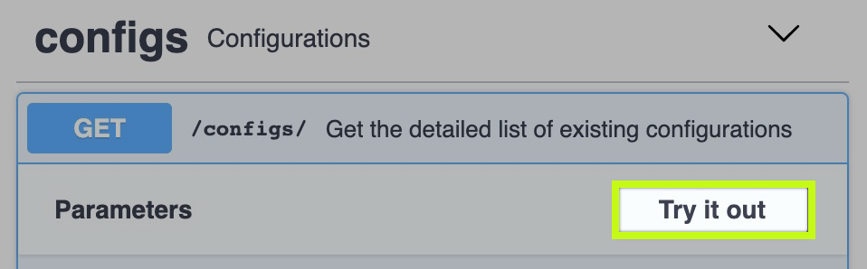

## Swagger

Swagger is a useful way to experiment and interact with the API. 

👉 [Click here to load Swagger](https://[[HOST_SUBDOMAIN]]-30000-[[KATACODA_HOST]].environments.katacoda.com/api/v1/)

Click on "`/configs`", selecting the "**Try it out**" button, and then selecting the "**Execute**" button.

Cool huh? Lets continue to Step 3. ⤵️