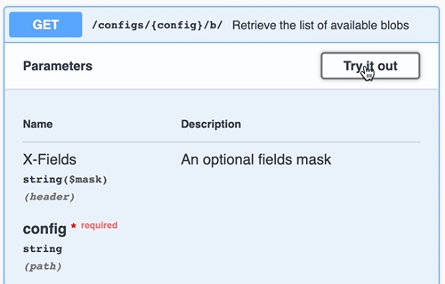

## Swagger

Swagger is a useful way to experiment and interact with the API. Let's retrieve the list of available blobs for the `master` config.

👉 [Open Swagger](https://[[HOST_SUBDOMAIN]]-30000-[[KATACODA_HOST]].environments.katacoda.com/api/v1/)

* Look for and click: "**GET** `/configs/{config}/b/`" (in blue).
* Click "**Try it out**" button
* For the `config` parameter, type in `master`
* Then click the "**Execute**" button.

Cool huh? Lets continue. ⤵️