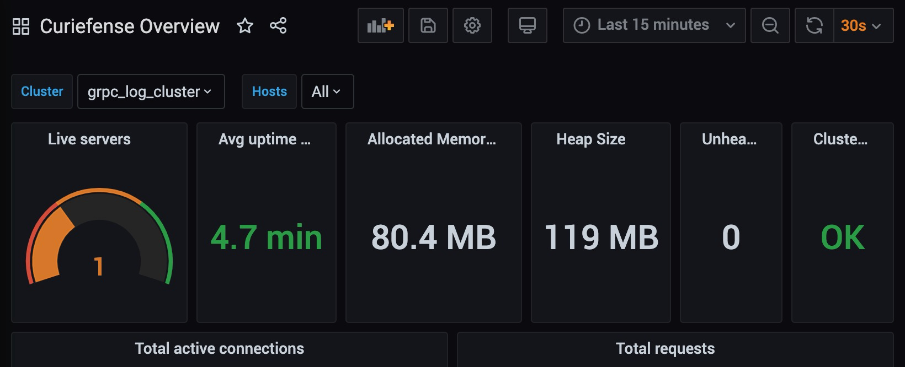

## Grafana Dashboards: Curiefense Overview

Available Panels

* Live Servers
* Avg Uptime Per Node
* Allocated Memory
* Heap Size
* Unhealthy Servers
* Cluster State
* Total Active Connections
* Total Requests
* Downstream Total Active Connections
* Downstream Total Active Requests
* Upstream Network Traffic
* Downstream Network Traffic
* Downstream Members

👉 [Launch Dashboards](https://[[HOST_SUBDOMAIN]]-30300-[[KATACODA_HOST]].environments.katacoda.com/dashboards?layout=list)

> Make sure to click "Curiefense Overview"

