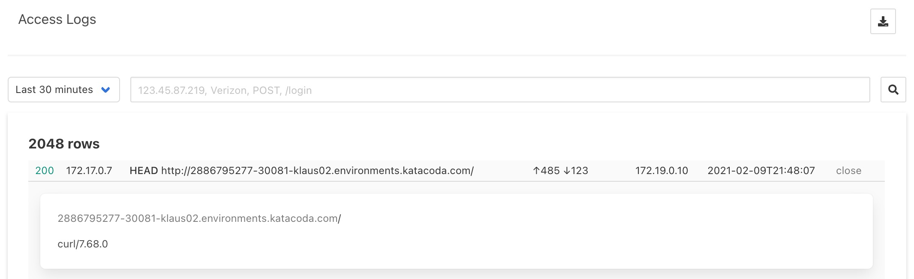

## Open the UI

Open the UI management console by clicking the "[Management UI](https://[[HOST_SUBDOMAIN]]-30080-[[KATACODA_HOST]].environments.katacoda.com)" tab.

This user interface will allow you to everything you can do via the API. This includes editing, downloading, deleting, and publishing:

1. Configurations (ACL Profiles, URL Maps, WAF Signatures, etc.)
1. System Settings
1. Access Logs

For now let's just look at the [Access Logs](https://[[HOST_SUBDOMAIN]]-30080-[[KATACODA_HOST]].environments.katacoda.com/accesslog)

In another 

