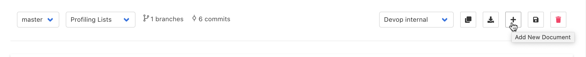
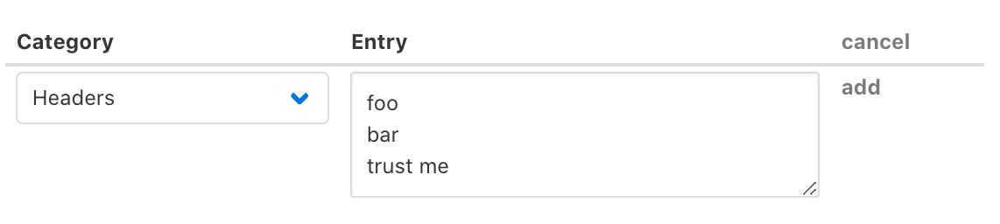

# Policy and Rules Configuration

## Create a Session Profiling list

* Start by creating a new Profiling List

* Next, in the **Tags** text box, enter the value `trusted` .
* Then, at the top of the (currently empty) list to the right, add a new entry by selecting the  +  button.  
    * Enter `foo` for its name, `bar` for value, and `trust me` for annotation. Now click on the "add" link.

