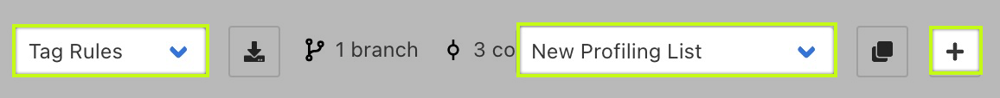
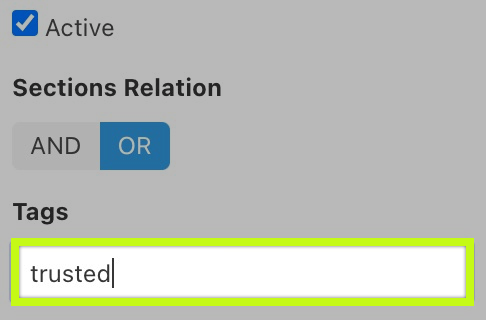
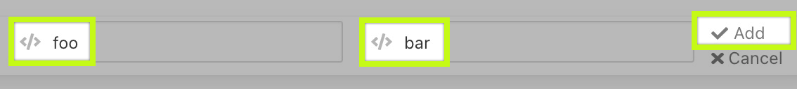
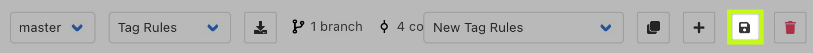
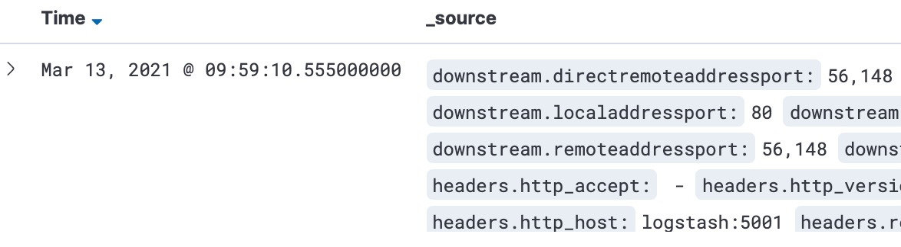

## Create a Tag Rules List

Open the UI management console by clicking the "[Management UI](https://[[HOST_SUBDOMAIN]]-30080-[[KATACODA_HOST]].environments.katacoda.com)" tab.

⚠️ You might need to click the refresh icon  if the UI is stuck loading.

Start by creating a new Tag Rules List by selecting the "+" button at the top:

Next, in the Tags text box on the left, enter the value `trusted`.

Then, at the top of the (currently empty) list to the right, add a new entry by selecting the `Create New Section` button. An empty rule will appear.

In the left pulldown, select Header. Enter `foo` for its name, and `bar` for its value. Then select "Add".

We have created a simple tag rule. Every request that contains a header named `foo` which matches the regex (PCRE) `bar` will receive a tag of `trusted`. 

Now save the new configuration:

Now it is time to test our configuration. Let's run the following curl commands:

`curl https://[[HOST_SUBDOMAIN]]-30081-[[KATACODA_HOST]].environments.katacoda.com/no/header`{{execute}}

`curl https://[[HOST_SUBDOMAIN]]-30081-[[KATACODA_HOST]].environments.katacoda.com/with/header -H "foo: bar"`{{execute}}

Navigating to [Access Log](https://[[HOST_SUBDOMAIN]]-5601-[[KATACODA_HOST]].environments.katacoda.com/app/discover) should show a screen similar to this:

